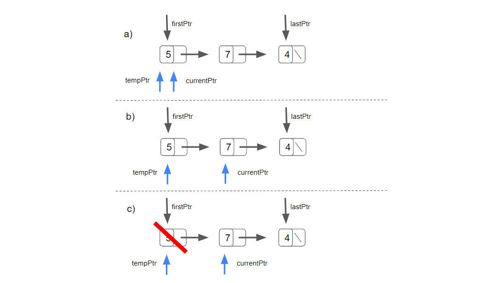
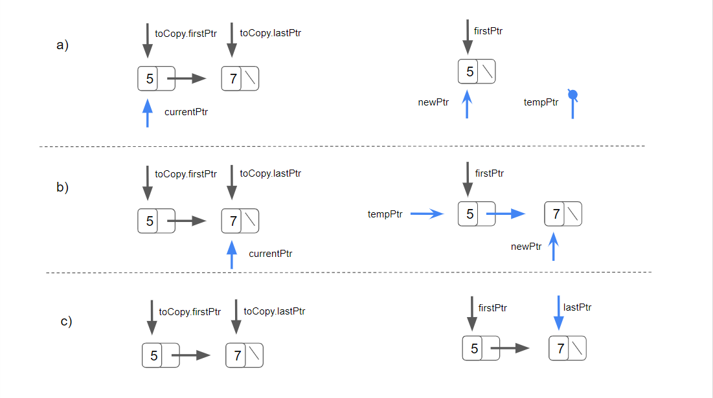
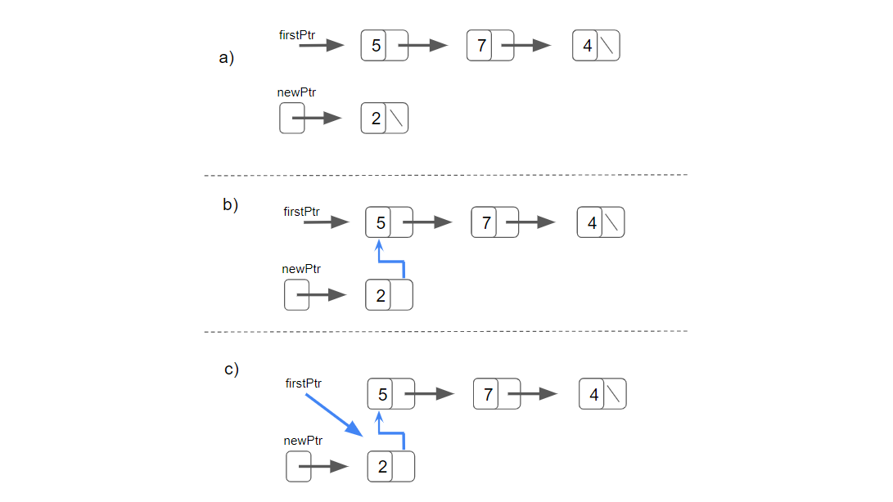
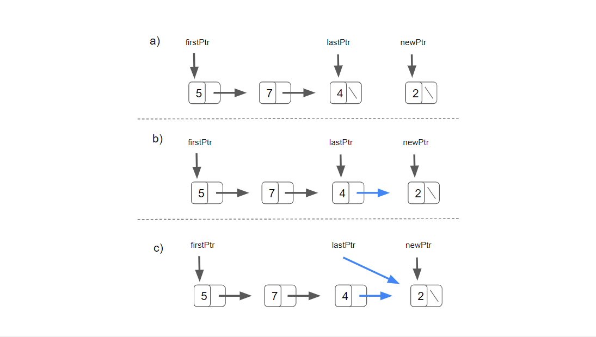
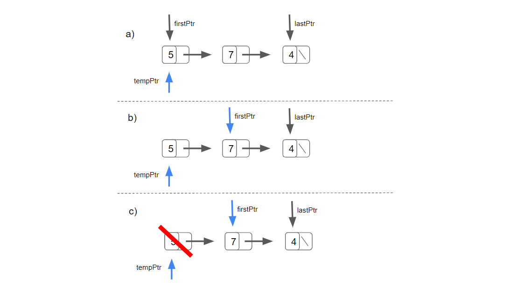
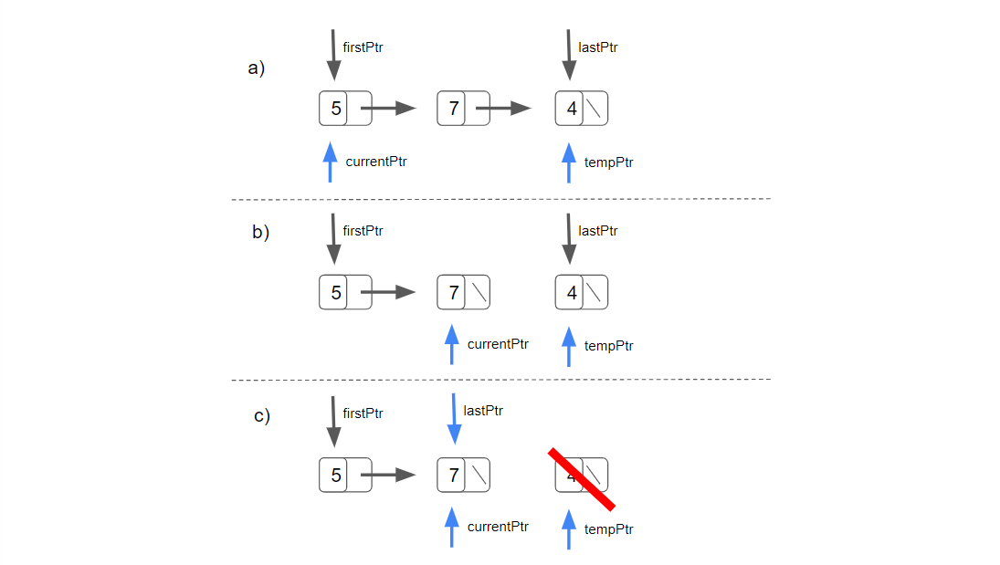

# DataStructures-Algorithms
A collection of custom Data Structures and Algorithms written in C++


# Linked List

This is a basic singly linked list.
The interface was not separated from the implementation in order to allow the compiler to generate a copy of the class template in which all the occurrences of the type parameter are replaced with the specified type.

The linked list has the following functions:

#### Destructor
The destructor call de-allocate the memory of the list's node.

The destructor attempts to destroy the nodes only if the list is not empty.

It iterates through the list with a currentPtr initialised with the firstPtr of the list. 
A tempPtr is also initialised.

Every iteration the memory address hold by currentPtr is assigned to tempPtr (part a), then the currentPtr iterates to the next pointer (part b), and the object the newPtr was aiming at is deleted - the destructor is called and the memory is released - as showed in part (c).
```
tempPtr = currentPtr;
currentPtr = currentPtr->nextPtr;
delete tempPtr;
```



#### Copy-constructor
A copy-construct are invoked whenever a copy of an object is needed such as:
- intitialising a list object with the same elements of another list object of the same type,
- passing a list object by value to a function or
- returning a list object by value from a function

The copy-constructor takes a const reference to the list to copy as a parameter.
The copy-constructor attempts to copy the nodes only if the list is not empty.

It iterates through the list with a currentPtr initialised with the firstPtr of the listToCopy. 
A pointer called newPtr is intialised.

```
MyNode<NODETYPE>* CurrentPtr{ listToCopy.firstPtr };
MyNode<NODETYPE>* newPtr{ nullptr };
``` 

During every iteration a pointer called tempPtr is initialised with the memory address hold by newPtr (the first iteration it will be nullPtr).

The new operator allocates the memory, call the constructor and return a pointer to the newly created object with the value of the currentPtr. This pointer is assigned to newPtr. This can be seen in part (a).

```
newPtr = new MyNode<NODETYPE>{ CurrentPtr->getData() }; 
```

If the list was empty the value of newPtr is assigned to firstPtr.

Otherwise the memory address hold by newPtr is assigned to the tempPtr's nextPtr as shown is part (b).
```
tempPtr->nextPtr = newPtr;
```

Part (c) shows when newPtr (aiming at the last created node) is assigned to the lastPtr once the loop is finished.



#### Insert At Front
Insert At Front places a new node at the head of the list.




#### Insert At Back


#### Remove From Front


#### Remove From Back


#### Is Empty?

#### Print
