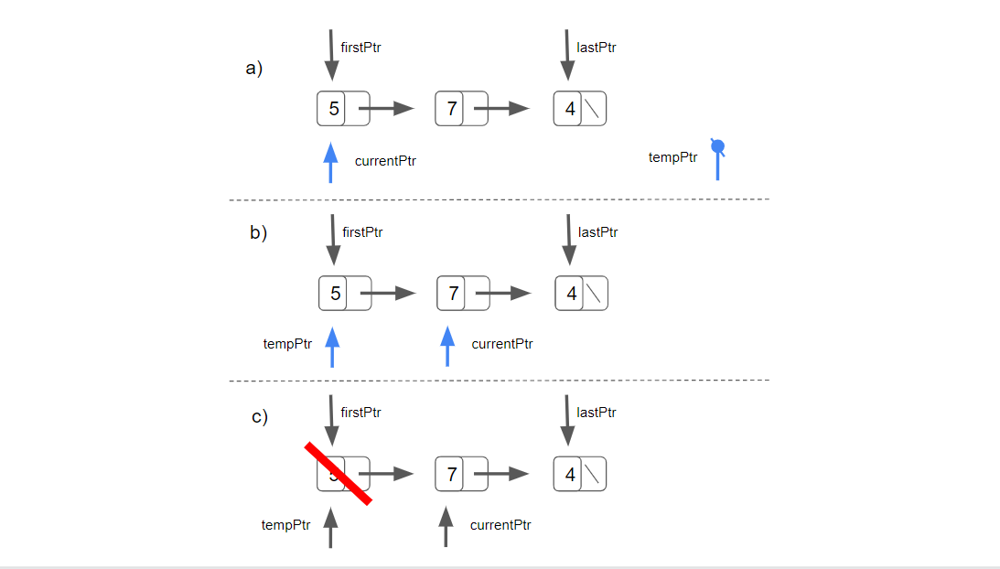
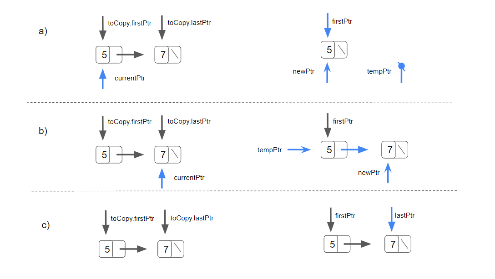
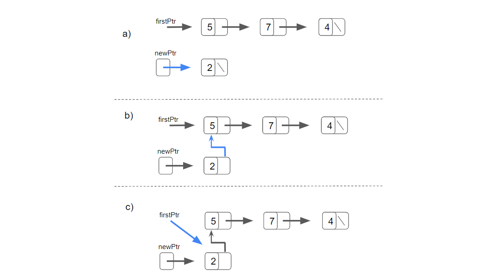
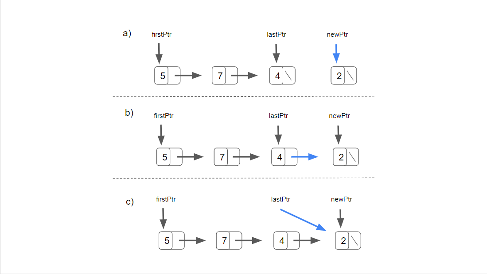
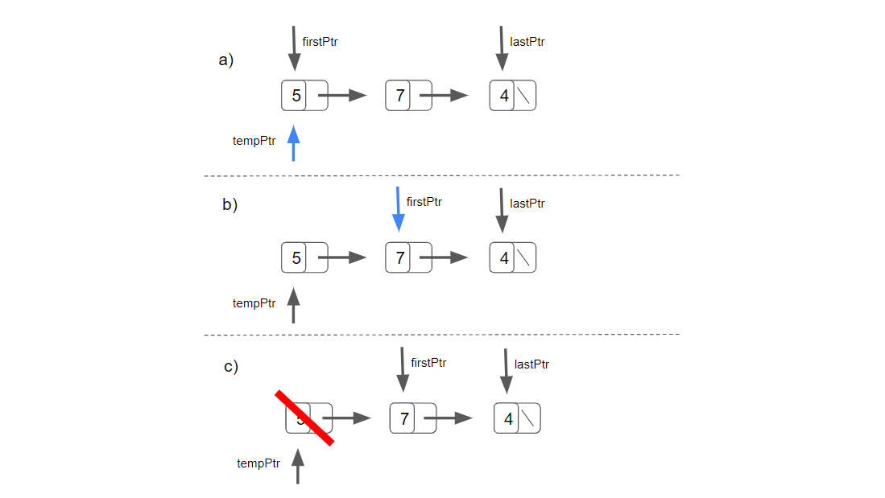
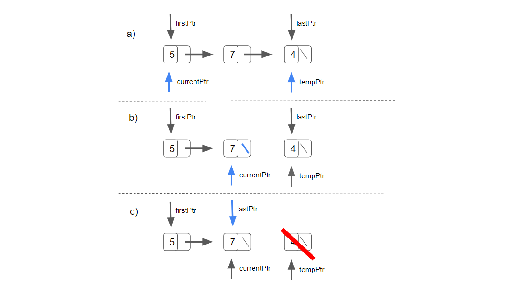

# DataStructures-Algorithms
A collection of custom Data Structures and Algorithms written in C++


# Linked List

This is a basic singly linked list.
The list has one pointer to the first node (firstPtr) and one to the last node (lastPtr).

The node class has two private member:
- data of the type NODETYPE
- a pointer to the next node called nexPtr

The linked list has the following functions:

#### Destructor
The destructor de-allocates the memory of the list's nodes.

The destructor attempts to destroy the nodes only if the list is not empty.

It iterates through the list with a pointer called currentPtr initialised with the memory address hold by the firstPtr of the list. 
A pointer called tempPtr is also initialised as shown in part (a).

```
MyNode<NODETYPE>* tempPtr{ nullptr };
MyNode<NODETYPE>* currentPtr{ firstPtr };
```

Every iteration the memory address hold by currentPtr is assigned to tempPtr, then the currentPtr iterates to the next pointer (part b), and the object the tempPtr was aiming at is deleted - the destructor is called and the memory is released - as showed in part (c).
```
tempPtr = currentPtr; // part (b)
currentPtr = currentPtr->nextPtr; // part (b)
delete tempPtr; // part (c)
```



#### Copy-constructor
A copy-construct are invoked whenever a copy of an object is needed such as:
- intitialising a list object with the same elements of another list object of the same type,
- passing a list object by value to a function or
- returning a list object by value from a function

The copy-constructor takes a const reference to the list to copy as a parameter.
The copy-constructor attempts to copy the nodes only if the listToCopy is not empty.

It iterates through the listToCopy with a pointer called currentPtr initialised with the memory address hold by the firstPtr of the listToCopy. 
A pointer called newPtr is also intialised.

```
MyNode<NODETYPE>* CurrentPtr{ listToCopy.firstPtr };
MyNode<NODETYPE>* newPtr{ nullptr };
``` 

During every iteration a pointer called tempPtr is initialised with the memory address hold by newPtr (the first iteration it will be nullPtr).

The new operator allocates the memory, call the its constructor and return a pointer to the newly created node with the value of the currentPtr. The pointer returned is assigned to newPtr. This can be seen in part (a).

```
newPtr = new MyNode<NODETYPE>{ CurrentPtr->getData() }; 
```

If the list is empty the memory address hold by newPtr is assigned to firstPtr.

Otherwise the memory address hold by newPtr is assigned to the tempPtr's nextPtr as shown is part (b).
```
tempPtr->nextPtr = newPtr;
```

Part (c) shows when the memory address hold by newPtr (aiming at the last created node) is assigned to the lastPtr once the loop is finished.



#### Insert At Front
Insert At Front places a new node at the head of the list.

Insert At Front takes a const reference to the value to be inserted onto the list.

The new operator allocates the memory, call the constructor and return a pointer to the newly created node. The value passed by reference to the function will be assigned as the node's data. The memory address hold by the returned pointer is assigned to a pointer called newPtr as shown in part (a).

```
MyNode<NODETYPE>* newPtr = new MyNode<NODETYPE>{ value };
```

If the list is empty both the firstPtr and the lastPtr will aim at the newly created node.

Otherwise the newly created node's nextPtr will be aimed at the firstPtr of the list. This is shown in part (b).

```
newPtr->nextPtr = firstPtr;
```

Eventually the firstPtr of the list is updated to aim at the newly created node as shown in part (c).

```
firstPtr = newPtr;
```



#### Insert At Back
Insert At Back places a new node at the tail of the list.

Insert At Back takes a const reference to the value to be inserted onto the list.

The new operator allocates the memory, call the constructor and return a pointer to the newly created node. The value passed by reference to the function will be assigned as the node's data. The memory address hold by the returned pointer is assigned to a pointer called newPtr as shown in part (a).

```
MyNode<NODETYPE>* newPtr = new MyNode<NODETYPE>{ value };
```

If the list is empty both the firstPtr and the lastPtr will aim at the newly created node.

Otherwise the lastPtr's nextPtr will be aimed at the newly created node as shown in part (b).

```
lastPtr->nextPtr = newPtr;
```

Eventually the lastPtr of the list is updated to aim at the newly created node as shown in part (c).

```
lastPtr = newPtr;
```




#### Remove From Front
Remove From Front attempts to remove an element from the head of the list.

If the list is empty the attempt to remove the element from the front fails.

A pointer called tempPtr is initialised with the memory address of the firtPtr as shown in part (a).

If the list has only one element, the node is dethread, leaving the list empty

```
firstPtr = lastPtr = nullptr;
```

Otherwise the firstPtr is aimed at the second element of the list as shown in part (b).

Eventually the node aimed by tempPtr is deleted - the destructor is called and the memory is released - as shown in part (c).



#### Remove From Back
Remove From Back attempts to remove an element from the tail of the list.

If the list is empty the attempt to remove the element from the back fails.

A pointer called tempPtr is initialised with the memory address of the lastPtr as shown in part (a).

If the list has only one element, the node is dethread, leaving the list empty. 

```
firstPtr = lastPtr = nullptr;
```
Otherwise the function iterates through the list with a pointer called currentPtr initialised with the memory address hold by the firstPtr of the list.
The iteration continues until the second-last node is found.

```
while (currentPtr->nextPtr != lastPtr)
{
    currentPtr = currentPtr->nextPtr;
}
```

Once the second-last element has been found, the currentPtr's nextPtr is assigned to nullPtr as shown in part (b).
Eventually the lastPtr is aimed at the second-last node as shown in part (c)



#### Is Empty?
Is Empty return true if the list is empty.

#### Print
The print function iterates through the list with a pointer called currentPtr initialised with the memory address hold by the firstPtr of the list.
Every iteration it prints the value of the node calling the getData() function. 

## How to contact me
For any feedback please send me an email: 
luigiplatania94@gmail.com

My website: https://www.luigiplatania.net/
