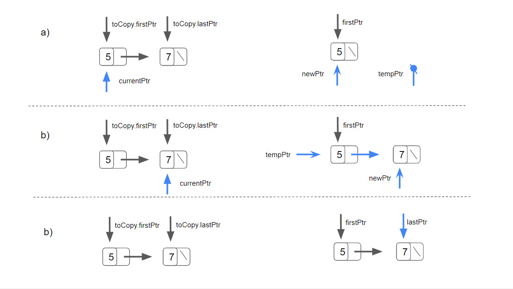

# DataStructures-Algorithms
A collection of custom Data Structures and Algorithms written in C++


# Linked List

This is a basic singly linked list.
The interface was not separated from the implementation in order to allow the compiler to generate a copy of the class template in which all the occurrences of the type parameter are replaced with the specified type.

The linked list has the following functions:

#### Destructor
The destructor attempts to destroy the nodes only if the list is not empty.

It iterates through the list until all the nodes have been deleted.


#### Copy-constructor
The copy-constructor takes a const reference to the list to copy as a parameter.
The copy-constructor attempts to copy the nodes only if the list is not empty.

It iterates through the list with a currentPtr initialised with the firstPtr of the listToCopy. Together with currentPtr a pointer called newPtr is intialised.

During every iteration a pointer called tempPtr is initialised with the value of newPtr (the first iteration will be nullPtr).
``` 	newPtr = new MyNode<NODETYPE>{ CurrentPtr->getData() }; ```

newPtr is then aimed toward a NodeType allocated


#### Insert At Front


#### Insert At Back


#### Remove From Front


#### Remove From Back


#### Is Empty?

#### Print
